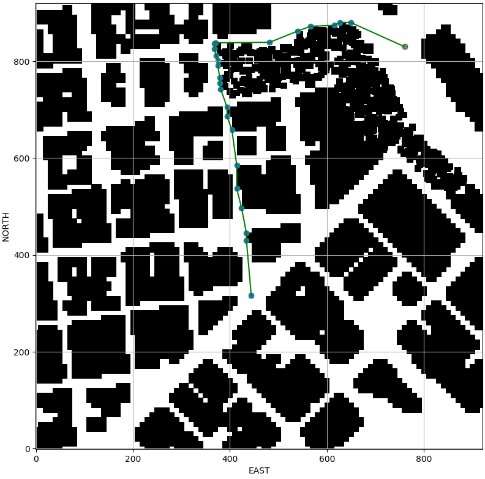

# **MotionPlanning**
1. **Explaination of code**
      1. [Click here for explaination of motion_planning.py](https://github.com/sparklytopaz/MotionPlanning/blob/master/motion_planning.md)
      2. [Click here for explaination of  planning_utils.py](https://github.com/sparklytopaz/MotionPlanning/blob/master/planningalgo.md)
  

**Things done in this Project** 

1. Load the 2.5D map in the colliders.csv file describing the environment.
2. Discretize the environment into a grid or graph representation.
3. Define the start and goal locations.
4. Perform a search using A* or other search algorithm.
5. Use a collinearity test or ray tracing method (like Bresenham) to remove unnecessary waypoints.
6. Return waypoints in local ECEF coordinates (format for self.all_waypoints is [N, E, altitude, heading], where the drone’s start location corresponds to [0, 0, 0, 0].

**Demo** 
***Input***

***Pruned Path***

***Demo on simulator***

